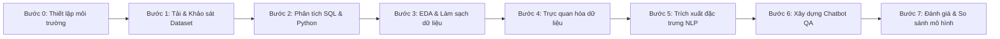

# AI2002 - Review Chatbot for Hotel Question Answering

> **Đề tài nghiên cứu khoa học:** Xây dựng hệ thống Chatbot thông minh hỗ trợ trả lời câu hỏi và tư vấn khách sạn dựa trên tập dữ liệu đánh giá thực tế từ TripAdvisor.  
> **Khóa học:** AI2002  
> **Nhóm thực hiện:** Group 5  

---

## 📌 Giới thiệu đề tài (Introduction)

Trong thời đại số, đánh giá trực tuyến (online customer reviews) là nguồn dữ liệu vô giá đối với người dùng trước khi quyết định đặt phòng khách sạn. Tuy nhiên, việc phải đọc hàng trăm đến hàng nghìn bài đánh giá dài dòng và phân tán để tìm câu trả lời cho các thắc mắc cụ thể (ví dụ: *"Phòng khách sạn này có cách âm tốt không?"*, *"Bữa sáng tại khách sạn có phong phú không?"*, *"Vị trí có thuận tiện đến trung tâm không?"*) gây tốn nhiều thời gian và công sức.

Dự án **Review Chatbot for Hotel Question Answering** được phát triển nhằm giải quyết bài toán trên thông qua việc:
- Tự động hóa quá trình phân tích và khai phá các khía cạnh dịch vụ (*aspect-based opinion mining*) từ tập dữ liệu lớn các đánh giá khách sạn.
- Xây dựng cơ chế truy xuất thông tin ngữ nghĩa và trả lời câu hỏi thông minh (*Question Answering System*), hỗ trợ khách hàng đưa ra quyết định đặt phòng nhanh chóng và chính xác.

---

## 📊 Bộ dữ liệu nghiên cứu (Dataset Overview)

Dự án sử dụng bộ dữ liệu đánh giá khách sạn quy mô lớn thu thập từ **TripAdvisor** (`tripadvisor_review_hotel_dataset.csv`) với quy mô **~782,584 bản ghi** và **25 trường thông tin** chi tiết:

| Nhóm thông tin | Các trường dữ liệu chính | Mô tả mục đích |
| :--- | :--- | :--- |
| **Thực thể khách sạn** | `hotel_name`, `hotel_province`, `hotel_address`, `hotel_star` | Định danh khách sạn, khu vực địa lý và phân khúc sao |
| **Điểm số & Khía cạnh** | `normalized_score`, `Value`, `Rooms`, `Location`, `Cleanliness`, `Service`, `Sleep_Quality` | Đánh giá định lượng tổng quan và chi tiết từng khía cạnh dịch vụ |
| **Văn bản đánh giá (NLP)** | `normalized_title`, `normalized_content`, `Word_count`, `language` | Dữ liệu văn bản dùng để trích xuất đặc trưng, huấn luyện mô hình hỏi đáp |
| **Bối cảnh lưu trú** | `trip_type`, `Date`, `month`, `year` | Phân khúc chuyến đi (công tác, cặp đôi, gia đình) và thời gian trải nghiệm |

> *Lưu ý:* Do dung lượng file dataset vượt quá 100 MB (~705 MB), file được lưu trữ cục bộ trong thư mục `Data (Dataset, Data Frame, Chart Images)/` và được cấu hình bỏ qua bởi `.gitignore` theo quy định của GitHub.

---

## 🛠️ Quy trình triển khai (Research Workflow)

Quy trình nghiên cứu và phát triển được xây dựng bài bản qua các giai đoạn:



- **Bước 0: Cài đặt môi trường (Environment Setup):** Khởi tạo môi trường Python, kiểm tra phiên bản các thư viện nền tảng và kết nối CSDL SQLite `hotel_chatbot_research.db`.
- **Bước 1: Nhập và kiểm tra dữ liệu (Dataset Loading & Exploration):** Tự động nhận diện đường dẫn dataset, đọc file CSV đa ngôn ngữ (UTF-8) và kiểm tra phân bố các trường thuộc tính.
- **Bước 2: Phân tích dữ liệu kết hợp SQL & Python:** Đẩy dữ liệu vào SQLite để thực hiện các truy vấn phân tích sâu theo câu hỏi nghiên cứu (Research Questions).
- **Bước 3: Tiền xử lý & Khảo sát thăm dò (EDA & Text Cleaning):** Xử lý giá trị khuyết thiếu, chuẩn hóa văn bản tiếng Việt/tiếng Anh, loại bỏ nhiễu và từ dừng (stop words).
- **Bước 4: Trực quan hóa dữ liệu (Data Visualization):** Trực quan hóa tương quan giữa điểm đánh giá, mức độ hài lòng theo từng khía cạnh và đặc thù vùng miền.
- **Bước 5: Kỹ thuật trích xuất đặc trưng (Feature Engineering & NLP):** Biểu diễn văn bản bằng TF-IDF / Embeddings, trích xuất thực thể và từ khóa trọng tâm.
- **Bước 6: Xây dựng mô hình Hỏi Đáp & Chatbot:** Triển khai cơ chế đối khớp độ tương đồng ngữ nghĩa (Cosine Similarity / Semantic Search) để truy xuất câu trả lời phù hợp nhất.
- **Bước 7: Đánh giá hiệu năng (Evaluation):** So sánh và đánh giá độ chính xác, thời gian phản hồi của mô hình.

---

## 📁 Cấu trúc thư mục dự án (Project Structure)

```text
Hotel-Review-AI-Chatbot/
├── .gitignore                                 # Danh sách loại trừ file nặng, cache, môi trường ảo
├── README.md                                  # Tài liệu tổng quan đề tài và hướng dẫn
├── requirements.txt                           # Danh sách các thư viện phụ thuộc của dự án
├── Project.ipynb                              # Notebook chính triển khai đồ án nghiên cứu
└── Data/                                      # Thư mục chứa tập dữ liệu và CSDL SQLite
    ├── tripadvisor_review_hotel_dataset.csv   # Dataset gốc đánh giá khách sạn (~705 MB)
    └── chatbot.db                             # CSDL SQLite lưu trữ bảng dữ liệu
```

---

## 🚀 Hướng dẫn cài đặt & Chạy dự án (Getting Started)

### 1. Yêu cầu hệ thống
- Python 3.9+
- Jupyter Notebook / JupyterLab / VS Code (có cài tiện ích Python và Jupyter)

### 2. Cài đặt các thư viện cần thiết
> **💡 Lưu ý:** Notebook `Project.ipynb` đã tích hợp sẵn ô mã lệnh tự động kiểm tra và cài đặt toàn bộ thư viện từ `requirements.txt` vào môi trường ảo (`.venv`). Bạn chỉ cần mở và chạy notebook!

Nếu muốn cài đặt thủ công từ dòng lệnh Terminal:

```bash
# Kích hoạt môi trường ảo (nếu có)
source .venv/bin/activate    # Trên macOS/Linux
# .venv\Scripts\activate     # Trên Windows

# Cài đặt thư viện từ file requirements.txt
pip install -r requirements.txt
```

### 3. Chuẩn bị tập dữ liệu
Đảm bảo file `tripadvisor_review_hotel_dataset.csv` đã được đặt trong thư mục:
```text
Data (Dataset, Data Frame, Chart Images)/tripadvisor_review_hotel_dataset.csv
```
*(Chương trình hỗ trợ tự động tìm kiếm file trong thư mục trên, thư mục gốc hoặc Google Drive nếu chạy trên Google Colab)*.

### 4. Khởi chạy Notebook
Mở và chạy tuần tự các cell trong notebook chính:
```bash
jupyter notebook Project.ipynb
```

---

## 👥 Thành viên nhóm thực hiện (Team)

| STT | Họ và tên | Vai trò |
| :---: | :--- | :--- |
| 1 | **Triet Nguyen** *(nguyenphamminhtriet2611@gmail.com)* | Trưởng nhóm & Phát triển chính |
| ... | *Thành viên Group 5* | Nghiên cứu dữ liệu & Kiểm thử |

---

## 📄 Bản quyền (License)
Dự án được phát triển phục vụ mục đích nghiên cứu học thuật trong khuôn khổ môn học AI2002.