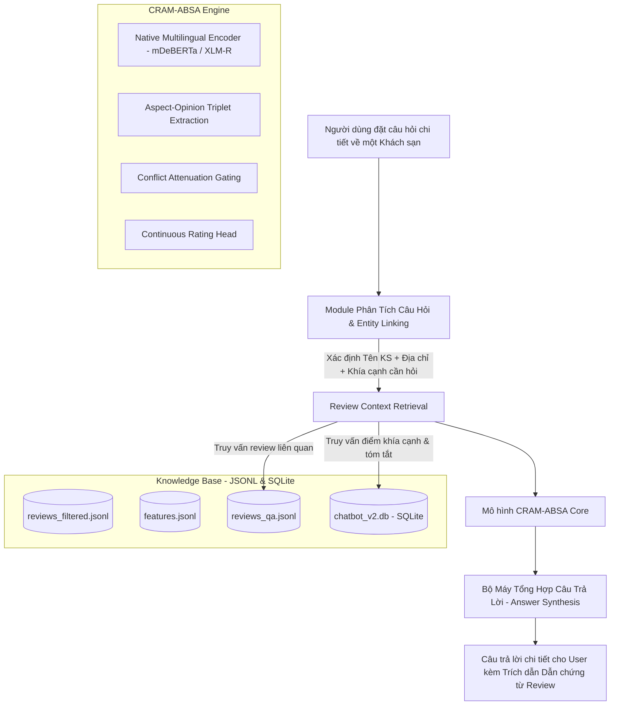

# DAP391m - AI2002 - Group 5: Hotel Review AI Chatbot

> **Đề tài nghiên cứu khoa học:** *Joint Fine-Grained Opinion Extraction and Overall Rating Prediction from Real-World Hotel Reviews for Review-Based Question Answering Systems*  
> **Định vị trọng tâm:** **HỆ THỐNG HỎI ĐÁP CHI TIẾT VỀ KHÁCH SẠN DỰA TRÊN ĐÁNH GIÁ (HOTEL REVIEW-BASED QA)** — *Tuyệt đối KHÔNG PHẢI hệ thống gợi ý / đề xuất khách sạn (Non-Recommendation).*  
> **Học kỳ:** Fall 2026 | **Môn học:** DAP391m | **Lớp:** AI2002 | **Nhóm:** Group 5

---

## 🎯 1. Giới thiệu Đề tài & Định vị Nghiên cứu (Introduction & Positioning)

### ❌ Sự khác biệt với Hệ thống Đề xuất (Recommendation System)
* **Hệ thống đề xuất (Recommender System):** Trả lời câu hỏi *"Gợi ý top khách sạn 5 sao ở Đà Nẵng?"*, *"Khách sạn nào giá rẻ gần biển?"* dựa trên điểm số trung bình vĩ mô và bảng xếp hạng (ranking).
* **Hệ thống Hỏi Đáp của Nhóm (Review-Based Question Answering):** Người dùng đã nhắm đến một khách sạn cụ thể (hoặc đang cân nhắc một khách sạn nhất định) và có những **thắc mắc chuyên sâu về trải nghiệm thực tế**:
  * *"Khách sạn này có cách âm tốt không, ban đêm có bị tiếng ồn từ phố hay hành lang không?"*
  * *"Bữa sáng tại khách sạn có phong phú và ngon miệng không? Nhân viên phục vụ ra sao?"*
  * *"Vệ sinh phòng ốc, drap giường và khăn tắm ở đây có thực sự sạch sẽ không?"*
  * *"Thủ tục check-in và check-out có nhanh chóng, nhân viên có thân thiện không?"*

### 💡 Bài toán cần giải quyết (Problem Statement)
Trong thực tế, một khách sạn có thể có hàng trăm đến hàng nghìn bài đánh giá dài dòng, phân tán và thậm chí chứa nhiều ý kiến mâu thuẫn (*mixed/conflicting opinions*). Người dùng không thể đọc hết từng bài review để tìm câu trả lời cho các băn khoăn cụ thể trên.

Dự án phát triển một hệ thống **Chatbot Hỏi Đáp Đa Ngôn Ngữ Thông Minh** có khả năng:
1. **Định danh cơ sở khách sạn chính xác** theo cặp `(hotel_name, hotel_address)`, tránh nhầm lẫn giữa các chi nhánh hoặc khách sạn cùng chuỗi thương hiệu.
2. **Truy xuất các đoạn đánh giá liên quan nhất** với thắc mắc của người dùng từ kho dữ liệu đánh giá thực tế.
3. **Ứng dụng mô hình CRAM-ABSA (Conflict-Aware Multi-Task Aspect Sentiment & Rating Prediction)** để khai phá sâu ý kiến theo khía cạnh: trích xuất bộ ba `(Aspect, Opinion, Sentiment Polarity)`, lượng hóa mức độ khen/chê và xử lý ý kiến trái chiều.
4. **Tổng hợp câu trả lời khách quan, đa chiều** kèm theo bằng chứng trích dẫn thực tế từ các bài đánh giá của du khách.

---

## 🏗️ 2. Kiến Trúc Pipeline Hệ Thống Hỏi Đáp (System Architecture)

### Các thành phần chính trong kiến trúc:
1. **Entity & Aspect Parser:** Tách tên khách sạn, địa điểm và nhận diện khía cạnh người dùng quan tâm (`Rooms`, `Cleanliness`, `Service`, `Location`, `Sleep_Quality`, `Value`).
2. **Context Retrieval Engine:** Tìm kiếm các đoạn review có độ tương quan ngữ nghĩa cao nhất dựa trên kho dữ liệu `reviews_qa.jsonl` và cơ sở dữ liệu SQLite `chatbot_v2.db`.
3. **CRAM-ABSA Model:** Đọc hiểu văn bản đa ngôn ngữ, trích xuất chuẩn xác các từ ngữ chỉ khía cạnh (Target Span), từ chỉ quan điểm (Opinion Span) và gán nhãn phân cực cảm xúc (Positive / Negative / Neutral).
4. **Answer Generation with Evidence:** Chatbot không trả lời vu vơ mà đưa ra nhận xét tổng quan kèm trích dẫn nguyên văn đánh giá thực tế của khách hàng.

---

## 📊 3. Bộ Dữ Liệu & Chuẩn Hóa Định Dạng (Dataset & JSONL Schema)

Dự án sử dụng bộ dữ liệu đánh giá thực tế thu thập từ **TripAdvisor** với quy mô **~782,584 bài đánh giá** và **25 trường thông tin**.

### Chuẩn hóa dữ liệu 100% bằng JSON Lines (`.jsonl`)
Để phục vụ tối ưu cho các mô hình học sâu NLP (PyTorch, Hugging Face Transformers) và bảo tồn trọn vẹn cấu trúc lồng nhau của bài toán trích xuất khía cạnh (ASTE / ABSA), **dự án đã loại bỏ hoàn toàn các file CSV trung gian** và chuyển sang định dạng JSON Lines:

| File dữ liệu | Định dạng | Mục đích sử dụng |
| :--- | :---: | :--- |
| `Data/dts_raw/tripadvisor_review_hotel_dataset.parquet` | Parquet / Snappy | Dữ liệu gốc quy mô lớn, nạp siêu tốc vào RAM |
| `Data/train/reviews_filtered.jsonl` | JSONL | Dữ liệu sạch sau 6 bước lọc (ngôn ngữ, độ dài, trùng lặp, định danh Tên + Địa chỉ) |
| `Data/train/features.jsonl` | JSONL | Tập dữ liệu tích hợp 10 đặc trưng phân tích chất lượng và ngữ cảnh review |
| `Data/train/reviews_qa.jsonl` | JSONL | **Corpus huấn luyện Chatbot QA**: Mỗi dòng là 1 review hoàn chỉnh kèm metadata, khía cạnh và features |
| `Data/db/chatbot_v2.db` | SQLite 3 | CSDL quan hệ gồm 3 bảng (`hotels`, `reviews`, `hotel_summaries`) phục vụ Chatbot truy vấn thời gian thực |

---

## 🌐 4. Chiến Lược Đa Ngôn Ngữ Bản Địa (Native Multilingual Strategy)

* **Loại bỏ hoàn toàn máy dịch (No Translation Engine):** Không sử dụng Google Translate API hay dịch ép về tiếng Anh nhằm:
  * Tránh lỗi **lệch ranh giới từ (Span Boundary Drift)** làm tụt giảm Exact F1 trong bài toán trích xuất khía cạnh.
  * Giữ nguyên sắc thái cảm xúc, từ ngữ địa phương và từ lóng thực tế của du khách.
  * Loại bỏ nút thắt cổ chai về thời gian và giới hạn Rate Limit API trên tập dữ liệu hàng trăm nghìn bài đánh giá.
* **Mô hình Backbone:** Định hướng huấn luyện trên các mô hình Transformer đa ngôn ngữ tiên tiến:
  * `microsoft/mdeberta-v3-base` (cùng kiến trúc DeBERTa Disentangled Attention nhưng hỗ trợ 100+ ngôn ngữ).
  * `xlm-roberta-base` / `xlm-roberta-large`.

---

## 🧪 5. Ví Dụ Kịch Bản Hỏi Đáp Thực Tế của Chatbot

* **Kịch bản 1 (Chất lượng giấc ngủ & Cách âm):**
  * **User:** *"Khách sạn Mường Thanh tại Đà Nẵng phòng ốc có cách âm tốt và yên tĩnh để ngủ không?"*
  * **Chatbot:** Trích xuất điểm khía cạnh `Sleep_Quality` (4.2/5.0) và trích dẫn trực tiếp đánh giá của du khách: *"[4★]: Khách sạn view biển đẹp, phòng tầng cao khá yên tĩnh, không bị ảnh hưởng bởi tiếng xe ngoài đường..."*
* **Kịch bản 2 (Dịch vụ ăn uống & Thái độ phục vụ):**
  * **User:** *"Dịch vụ và thái độ nhân viên tại Vinpearl Nha Trang được đánh giá thế nào?"*
  * **Chatbot:** Tổng hợp từ bộ nhớ khía cạnh `Service`: Điểm trung bình 4.6/5.0, điểm cộng nổi bật: *"thân thiện, nhiệt tình, chu đáo"*, điểm khách lưu ý: *"giờ cao điểm check-in sảnh hơi đông"*.
* **Kịch bản 3 (Độ sạch sẽ & Vệ sinh phòng ốc):**
  * **User:** *"Vệ sinh phòng tại khách sạn Sofitel Hà Nội có sạch sẽ không?"*
  * **Chatbot:** Xác nhận điểm `Cleanliness` 4.8/5.0 kèm câu nhận xét chi tiết: *"[5★]: Phòng ốc cực kỳ sạch sẽ, thơm mùi tinh dầu tự nhiên, khăn tắm và drap giường được thay mới mỗi ngày."*

---

## 👥 6. Thông Tin Nhóm Thực Hiện
* **Môn học:** DAP391m - Data Analysis Project
* **Lớp:** AI2002 - Trường Đại học FPT TP.HCM
* **Nhóm thực hiện:** Group 5 (Fall 2026)